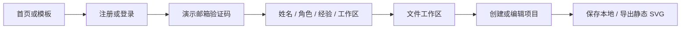

# Jitter：核心交互、视觉风格与代码解析

本文基于 2026-09-15 的本地代码。首页和公开注册入口参考 <https://jitter.video/>；验证之后的引导、工作区与简化编辑器属于本地实现，不代表原站私有登录后页面的一比一复刻。

## 1. 架构与阅读入口

项目使用 Vue 3、TypeScript、Vite 和 Lucide。由根组件分派页面，模块级响应式状态负责本地资料与项目持久化。

| 入口 | 职责 |
| --- | --- |
| [src/App.vue](../src/App.vue) | History 路由、导航、页面分派与路径守卫 |
| [src/state.ts](../src/state.ts) | Profile/Project 模型、存储、路由守卫、创建与退出 |
| [src/components/HomePage.vue](../src/components/HomePage.vue) | 首页、模板库、定价、FAQ 和模板预览 |
| [src/components/AuthFlow.vue](../src/components/AuthFlow.vue) | 演示邮箱验证与四步引导 |
| [src/components/WorkspacePage.vue](../src/components/WorkspacePage.vue) | 文件列表、模板入口、编辑器、设置、删除与 SVG 导出 |
| [src/components/VideoTile.vue](../src/components/VideoTile.vue) | 视频可见性控制和失败回退 |
| [src/style.css](../src/style.css) | 品牌页面、引导、工作区和编辑器样式 |

## 2. 视觉风格

| 规则 | 当前实现与用途 |
| --- | --- |
| 字体 | Lausanne 400/600/800 为主，Inter 为补充；字体文件位于本地 assets |
| 色彩 | 白底与 `#19181b` 文字，浅紫 `#b498f5`、深紫 `#8055cf`，模板穿插亮绿和其他配色 |
| 首页 | 大字号标题、留白、横向视频样例和品牌标志，动效内容本身承担主要视觉 |
| 引导页 | 左侧步骤表单与右侧随步骤变化的海报，角色与经验使用可选项列表 |
| 工作区 | 左侧导航、顶部工具栏、文件网格和模板列表，进入持续使用的工具布局 |
| 编辑器 | 原生 dialog 内安排画板、属性区和简化时间轴，手机端改为上下布局 |
| 动效 | 本地视频样例与 CSS 动画；减少动态效果规则禁用 CSS animation/transition |

模板视频是视觉参考资源。选择模板仅初始化项目名称、颜色等本地数据，不会导入该视频的完整动画工程。

## 3. 用户主流程

| 交互 | 对应状态 | 反馈 |
| --- | --- | --- |
| 搜索/筛选模板 | `search`、`category` | 筛选视频卡片，显示空结果与清除入口 |
| 查看模板 | `selectedTemplate` 与原生 dialog | 播放预览，可携带模板进入注册/工作区 |
| 演示验证 | `authStep`、email/code/error | choice、email、code 三阶段，验证码为 `123456` |
| 四步引导 | `step`、资料字段、`validStep` | 必填校验、回退、进度保存、最终进入 files |
| 文件管理 | projects、search、deleteTarget | 新建、搜索、打开、确认删除 |
| 编辑与导出 | activeProject、playing | 改文字/底色、CSS 预览播放暂停、下载静态 SVG |
| 年/月计费 | yearly | 展示示意价格，不收取款项 |

## 4. 核心组件代码解析

### 4.1 state.ts：可恢复的本地数据

`Profile` 包含邮箱、姓名、角色、经验、工作区、active、complete 和 step。`Project` 包含 id、name、text、color、template、updated。

`normalizeProfile` 对 localStorage 读取值逐字段校验，截断字符串并限制步骤范围；项目读取验证颜色格式、模板编号和必要字段。写入失败时设置 `storageWarning`，界面继续保留内存状态。

资料存于 `jitter-demo-profile`，项目按邮箱存于 `jitter-demo-projects:<email>`。`verifyDemoEmail` 切换邮箱时重置资料并加载该邮箱的文件；`signOut` 只取消 active，不删除文件。

实现思路：读取持久化数据也需要校验，不能认为 localStorage 永远符合 TypeScript 类型。这里的邮箱分组是数据组织方式，不是权限隔离或真实认证。

### 4.2 路由守卫与模板意图传递

入口：`guardedPath`、根组件 `navigate`、`start`、`onPopState`。

进入 `/files` 时，未验证跳 `/join`，已验证但资料不完整跳 `/onboarding`；`/onboarding` 也要求 active。守卫应用于初次加载、程序导航与浏览器返回。

用户从模板开始时，把模板 id 存入 `pendingTemplate`。工作区挂载后消费并清空它，再创建项目，避免重复创建。该值仅在内存中，跨整页刷新不会持久保存模板意图。

实现思路：导航守卫只负责决定允许的路径，创建项目在工作区完成。不要在每次路由渲染时直接创建文件。

### 4.3 AuthFlow：两个状态机组合

注册/登录使用 `authStep: choice | email | code`。邮箱校验通过后进入 code，`verifyCode` 比较固定演示码，再调用 `verifyDemoEmail`。Google 按钮打开明确的本地演示对话框，不调用 OAuth。

引导使用 `step: 0..3`，依次收集姓名、角色、经验、工作区。`validStep` 只验证当前步骤；watch 在 active 状态下保存输入和步骤，最后一步将 complete 置为 true。

异步 DOM 更新后给输入或标题设置焦点，使每一步开始位置明确。错误消息与步骤切换分开处理，返回上一页不会错误保留后一步错误。

实现思路：登录选择阶段与资料引导阶段使用不同状态，避免一个数字混合表示验证码页和角色页。真实认证接入后需替换演示验证，并由服务器校验身份。

### 4.4 WorkspacePage：编辑同一份响应式项目

`createProject` 生成 UUID 并把项目放入列表；`openProject` 将列表对象设为 activeProject，等待渲染后 `showModal`。编辑修改同一项目对象，`updateProject` 更新保存时间并调用 `saveProjects`。

删除先设置 deleteTarget，确认后按 id 过滤列表；工作区改名只影响 profile.workspace。原生 dialog 提供独立的编辑、设置与删除表面。

`exportDesign` 转义文本中的 XML 特殊字符，将最多 5 行文案写成 SVG 的 tspan，添加背景色，再用 Blob URL 下载并回收 URL。导出是 1080×1080 的静态 SVG，不是视频或 Lottie。

实现思路：文案和底色属于持久项目数据，playing 属于临时预览状态，不必写进存储。新增真实时间轴时应扩展项目模型，而非只增加一排装饰轨道。

### 4.5 VideoTile：媒体封装与当前限制

组件接收 source、label、paused。video 为 muted、loop、playsinline，预加载 metadata；IntersectionObserver 在 10% 可见阈值下决定播放或暂停，减少动态效果时暂停。加载错误后切换到标签回退视图。

`syncPlayback` 会读取 document.hidden 和 paused，但当前没有独立监听 visibilitychange，也没有 watch paused。因此不能把它描述成任何情况下都实时同步这两个状态；后续扩展时应在同一函数入口补触发机制。

实现思路：统一媒体生命周期可以避免每张卡重复编写 observer。新增媒体控制时，还需保持卸载清理和 play promise 的失败处理。

## 5. 维护与验证

运行 `npm test`、`npm run typecheck`、`npm run build`。测试入口为 [state.test.ts](../src/state.test.ts) 和 [AuthFlow.test.ts](../src/components/AuthFlow.test.ts)，主要覆盖资料规范化、持久化与引导流程；不能据此推断视频和导出已有完整端到端覆盖。

手动重点：非法邮箱、错误验证码、刷新恢复步骤、直接访问 files、切换演示邮箱、存储禁用、新建/删除确认、模板消费、包含特殊字符的 SVG 导出及手机编辑器。

Newsletter 仅本地反馈；真实邮件、身份、付款、协同、AI、Figma 导入与动画编码均未接入。更多运行说明见 [项目 README](../README.md)。本文是代码文档变更，不包含本次测试执行结果。
